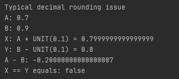
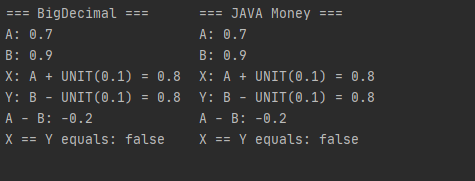

# Money rounding issue in Java - BigDecimal and JSR 354
A simple Java project shows a decimal rounding problem using Java. More details can be found here: https://dzone.com/articles/never-use-float-and-double-for-monetary-calculatio

YouTube video: https://youtu.be/r5oOtlWpzHE

JavaMoney: https://javamoney.github.io/

The rounding issue:  

Example solutions:  

# Technology stack
- JDK 11
- Gradle

## Gradle
If you encounter any problems, run a Gradle command with additional parameters: `--warning-mode all` and `--stacktrace` (if you want to see the full output).

### Gradle commands (using wrapper)
- ./gradlew dependencies
- ./gradlew run
- ./gradlew clean
